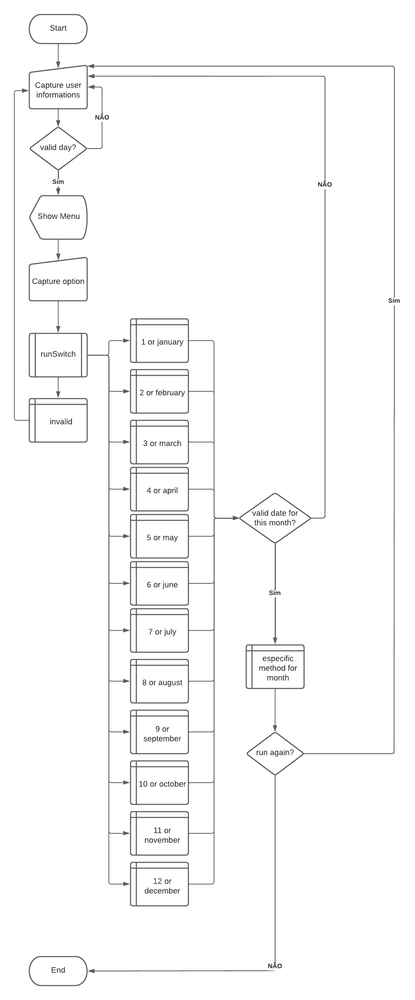

# First question of the first exam - java algorithms

## Description
> Create a program that informs the sign of the user
> - Capture name, day and month of birthday
> - Create a constant for the limit number of the day of the month, in this case 31
> - if the day is greater than the limit
>     - Inform the limit value for one day of the month
> - If not
>     - choose the corresponding month to carry out the specific validations
>         - Does this day exist in this month?
>         - based on the day of the month what is the sign
>         - invalid month

## Fluxogram

 

## test the program here

&nbsp;

 