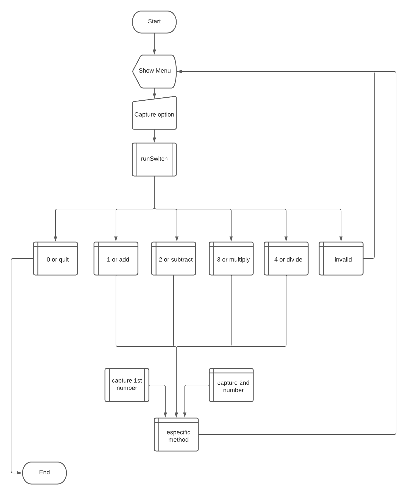

# Second question of the first exam - java algorithms

## Description
> Create a program that makes multiple drawings 
> Inform which operation you want to perform if it informs 0, it must terminate the program
> - 1 add
> - 2 subtract
> - 3 multiplier
> - 4 division
> 
> Capture the 2 values and the result and wait for the next calculation to inform

## Fluxogram

 

## test the program here
  
&nbsp;