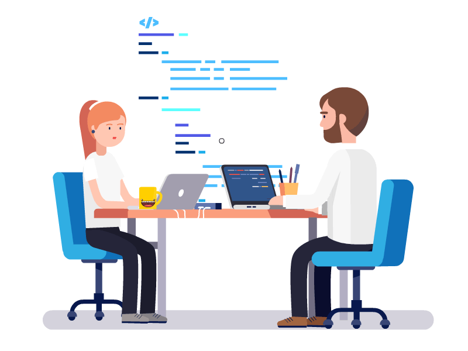

# entra21 Lógica de programação com Java
Repositório com as práticas realizadas em aula  

> Conteúdo prático realizado em sala durante o projeto Entra21
> Em aditivo oportunidades de aprendizado em:
> - Versionamento
> - Linguagem markdown
> - Documentação

## Aula Ministradas

| AULA | ASSUNTO |
|------|---------|
|Aula 02 - 01|[Variáveis](./Aula%2002%20-%2001%20-%20Variaveis/)                                    
|Aula 02 - 02|[Constantes](./Aula%2002%20-%2002%20-%20Constantes/)
|Aula 03 - 01|[Operadores Aritméticos](./Aula%2003%20-%2001%20-%20Operadores%20Aritméticos/)
|Aula 03 - 02|[Incremento e Decremento](./Aula%2003%20-%2002%20-%20Incremente%20e%20Decremento/)
|Aula 04 - 01|[Operadores de Igualdade](./Aula%2004%20-%2001%20-%20Operadores%20de%20Igualdade/)
|Aula 04 - 02|[Operadores Relacionais](./Aula%2004%20-%2002%20-%20Operadores%20Relacionais/)
|Aula 04 - 03|[Operadores Lógicos](./Aula%2004%20-%2003%20-%20Operadores%20Lógicos/)
|Aula 05 - 01|[IF](./Aula%2005%20-%2001%20-%20IF/)
|Aula 05 - 02|[IF-ELSE](./Aula%2005%20-%2002%20-%20IF_ELSE/)
|Aula 05 - 03|[Operador Ternário_src](./Aula%2005%20-%2003%20-%20Operador%20Ternário_src/)
|Aula 05 - 04|[ELSE_IF](./Aula%2005%20-%2004%20-%20ELSE_IF/)
|Aula 06 - 01|[Switch](./Aula%2006%20-%2001%20-%20Switch/)
|Aula 07 - 01|[Funções](./Aula%2007%20-%2001%20-%20Funções/)
|Aula 09 - 01|[For](./Aula%2009%20-%2001%20-%20FOR/)
|Aula 10 - 01|[While / Do-While](./Aula%2010%20-%2001%20-%20Estrutura%20While/)
|Aula 11 - 01|[While / Do-While - Práticas em sala](./Aula11%20-%2001%20-PraticaEmSala/)
|Aula 12 - 01|[Vetores](./Aula12%20-%2001%20-%20Vetores/)
|Aula 13 - 01|[Vetores - Práticas em sala](./Aula13%20-%2001%20-%20ExercicioVetores/)